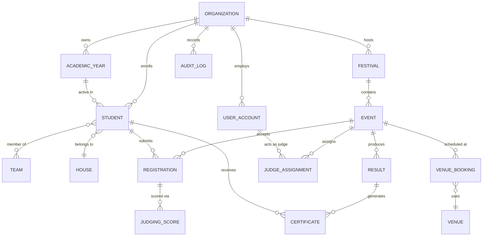
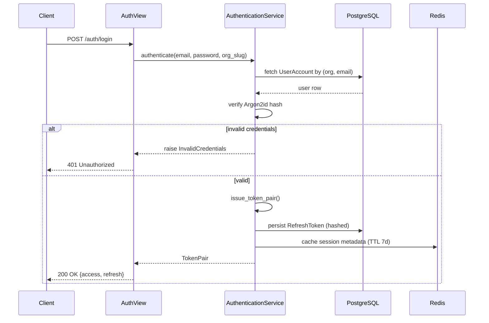
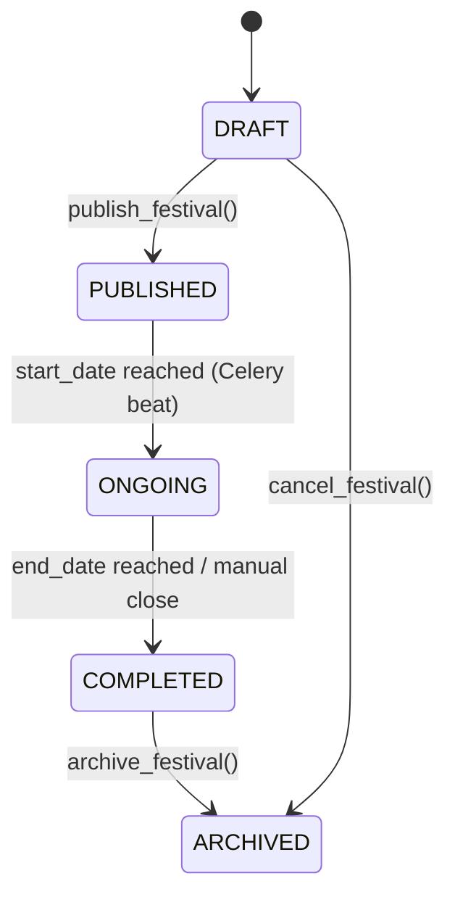
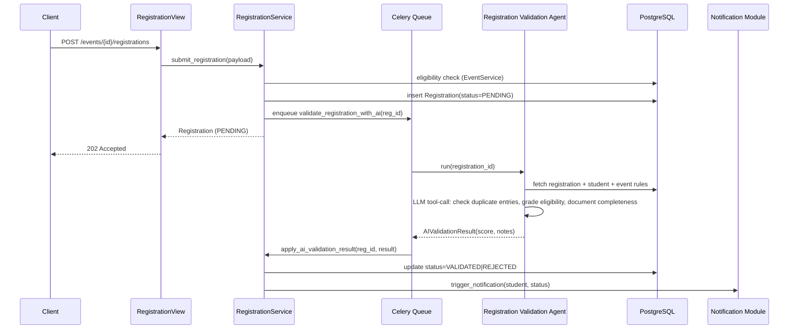
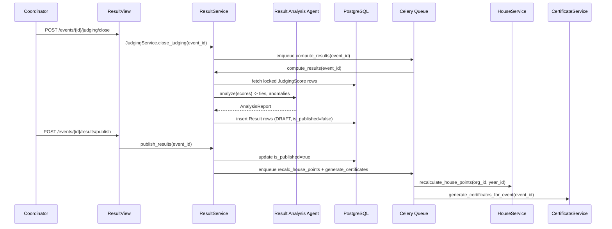
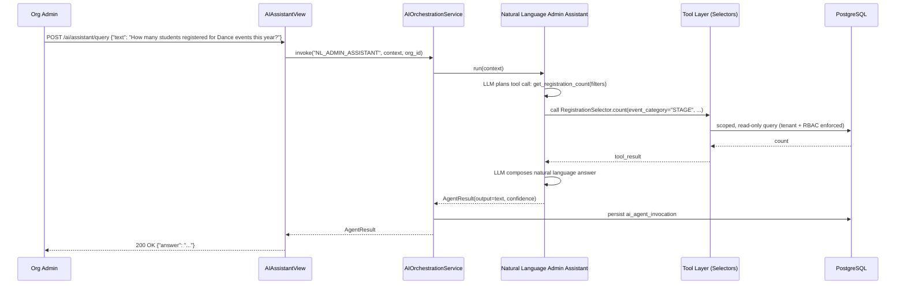
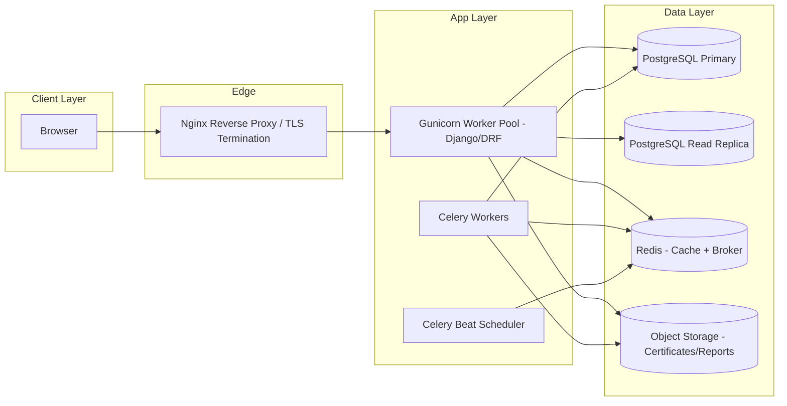

EVENTFLOW AI
ENTERPRISE AI-POWERED EVENT & FESTIVAL MANAGEMENT PLATFORM

LOW LEVEL DESIGN (LLD) DOCUMENT

Document Type: Low Level Design
Document Status: Baseline v1.0
Classification: Internal / Engineering
Audience: Software Architects, Backend Engineers, Frontend Engineers, AI Engineers, QA Engineers, DevOps Engineers, CTO, Enterprise Clients

---

## 0. Document Control

| Field | Value |
|---|---|
| Document Title | EventFlow AI — Low Level Design (LLD) |
| Product Name | EventFlow AI |
| Document Version | 1.0 |
| Preceding Documents | Product Vision Document, Business Requirements Document, Software Requirements Specification, High Level Design |
| Consistency Baseline | Django + DRF + PostgreSQL + Redis + Celery + Docker + JWT, React + TypeScript + Tailwind CSS, Modular Monolith, Clean Architecture / DDD, Multi-Tenant SaaS |
| Owner | Engineering Architecture Group |
| Review Cycle | Reviewed alongside every module release |

### 0.1 Purpose of This Document

This Low Level Design translates the High Level Design into implementation-ready specifications: database schemas, service and selector class contracts, REST API contracts, sequence flows, folder structures, and cross-cutting engineering rules. It is the direct reference used by engineers writing code, by QA engineers writing test plans, and by DevOps engineers preparing deployment pipelines.

### 0.2 Scope

This document covers the low level design of all twenty-one Core Modules defined in the master architecture: Authentication, RBAC, Organization Management, Academic Year, Students, Teachers, Teams, Houses, Festivals, Events, Venues, Registrations, Scheduling, Judging, Results, Certificates, Reports, Analytics, Notifications, Dashboard, Audit Logs, Settings, and the AI Module. It does not redefine business rules, module boundaries, or technology choices already fixed in the SRS and HLD; it operationalizes them.

### 0.3 How to Read This Document

Each module section follows the same structure: Purpose, Django App Mapping, Database Schema, Service Layer, Selector Layer, API Contract, Business Rules Enforced at Code Level, and (where relevant) a Mermaid sequence or state diagram of the module's most critical runtime flow.

---

## 1. Architectural Recap (Non-Redefining)

EventFlow AI is implemented as a **Modular Monolith** on **Django / Django REST Framework**, organized as one Django project containing one Django app per Core Module. Each app is internally layered using **Clean Architecture / Domain-Driven Design** conventions:

```
app/
  models.py          -> Persistence (Django ORM)
  services.py         -> Write-path business logic (Service Layer Pattern)
  selectors.py        -> Read-path query logic (Selector Pattern)
  serializers.py       -> DRF serializers (API boundary)
  views.py             -> Thin Views (delegate only)
  permissions.py        -> RBAC enforcement
  tasks.py               -> Celery async tasks
  signals.py              -> Domain events (Event Driven Architecture)
  validators.py            -> Domain validation rules
  exceptions.py             -> Domain-specific exceptions
  admin.py                   -> Django admin registration
  urls.py                      -> App-level routing
  tests/                        -> Unit + integration tests
```

**Golden Rule (enforced by code review and CI lint):** Views never contain business logic. Views call Services (writes) or Selectors (reads) only. Services never construct HTTP-layer objects. Selectors never mutate data.

### 1.1 Multi-Tenancy Model

EventFlow AI uses **row-level multi-tenancy** via a mandatory `organization_id` foreign key on every tenant-scoped model, enforced through:

1. A base abstract model `TenantScopedModel` (in `core/models.py`) that all tenant models inherit from.
2. A DRF base viewset/mixin `TenantScopedQuerysetMixin` that automatically filters `queryset.filter(organization=request.user.organization)`.
3. A PostgreSQL constraint layer plus Django manager (`TenantManager`) that makes cross-tenant queries structurally difficult to write by accident.

```python
# core/models.py
class TenantScopedModel(models.Model):
    organization = models.ForeignKey("organizations.Organization", on_delete=models.CASCADE, db_index=True)
    created_at = models.DateTimeField(auto_now_add=True)
    updated_at = models.DateTimeField(auto_now=True)
    is_deleted = models.BooleanField(default=False)

    objects = TenantManager()

    class Meta:
        abstract = True
```

### 1.2 Global Conventions Used Throughout This Document

| Convention | Rule |
|---|---|
| Primary Keys | UUID v4 (`models.UUIDField(default=uuid.uuid4, primary_key=True, editable=False)`) — prevents ID enumeration across tenants |
| Soft Delete | `is_deleted` boolean flag; hard delete never exposed via API |
| Timestamps | `created_at`, `updated_at` on every table |
| Money Fields | `DecimalField(max_digits=12, decimal_places=2)`, currency stored separately per Organization |
| API Versioning | URL-based: `/api/v1/...` |
| Pagination | Cursor pagination (`CursorPagination`), page size default 25, max 100 |
| Response Envelope | `{ "success": bool, "data": {...}, "errors": [...], "meta": {...} }` |
| Auth Header | `Authorization: Bearer <JWT>` |
| Idempotency | All POST endpoints that create financial/certificate records accept an `Idempotency-Key` header |

---

## 2. Entity Relationship Overview (Cross-Module)



---

## 3. Module: Authentication

### 3.1 Purpose
Issues, refreshes, and revokes JWT credentials; manages password lifecycle, MFA, and session security for all user types (Org Admin, Festival Coordinator, Teacher, Judge, Student).

### 3.2 Django App
`apps.authentication`

### 3.3 Database Schema

**Table: `auth_user_account`**

| Column | Type | Constraints |
|---|---|---|
| id | UUID | PK |
| organization_id | UUID | FK → organization.id, indexed |
| email | VARCHAR(255) | UNIQUE per organization, NOT NULL |
| password_hash | VARCHAR(255) | Argon2id hash |
| role | VARCHAR(30) | ENUM: SUPER_ADMIN, ORG_ADMIN, COORDINATOR, TEACHER, JUDGE, STUDENT |
| is_active | BOOLEAN | default true |
| mfa_enabled | BOOLEAN | default false |
| mfa_secret_encrypted | VARCHAR(255) | NULL, AES-256 encrypted at rest |
| last_login_at | TIMESTAMP | NULL |
| failed_login_count | SMALLINT | default 0 |
| locked_until | TIMESTAMP | NULL |
| created_at / updated_at | TIMESTAMP | auto |

**Table: `auth_refresh_token`**

| Column | Type | Constraints |
|---|---|---|
| id | UUID | PK |
| user_id | UUID | FK → auth_user_account.id |
| token_hash | VARCHAR(255) | SHA-256 hash of raw token, indexed |
| issued_at | TIMESTAMP | NOT NULL |
| expires_at | TIMESTAMP | NOT NULL |
| revoked_at | TIMESTAMP | NULL |
| device_fingerprint | VARCHAR(255) | NULL |

### 3.4 Service Layer

```python
# apps/authentication/services.py
class AuthenticationService:
    @staticmethod
    def authenticate(email: str, password: str, organization_slug: str) -> AuthResult:
        """Validates credentials, applies lockout policy, issues token pair."""

    @staticmethod
    def issue_token_pair(user: UserAccount, device_fingerprint: str) -> TokenPair:
        """Creates access token (15 min TTL) + refresh token (7 day TTL, rotated)."""

    @staticmethod
    def refresh_access_token(raw_refresh_token: str) -> TokenPair:
        """Rotates refresh token (single-use), revokes prior token, raises TokenReuseDetected
        if a previously-rotated token is replayed (indicates theft)."""

    @staticmethod
    def revoke_all_sessions(user_id: UUID) -> None:
        """Used on password change, account suspension, or explicit logout-everywhere."""

    @staticmethod
    def enable_mfa(user_id: UUID) -> MFAEnrollment:
        """Generates TOTP secret, returns provisioning QR payload."""
```

### 3.5 Selector Layer

```python
class AuthSelector:
    @staticmethod
    def get_active_sessions(user_id: UUID) -> QuerySet[RefreshToken]: ...

    @staticmethod
    def get_login_history(user_id: UUID, limit: int = 20) -> QuerySet[LoginAttempt]: ...
```

### 3.6 API Contract

| Method | Endpoint | Description | Auth |
|---|---|---|---|
| POST | `/api/v1/auth/login/` | Authenticate, returns token pair | Public |
| POST | `/api/v1/auth/refresh/` | Rotate access token | Refresh token |
| POST | `/api/v1/auth/logout/` | Revoke current refresh token | Bearer |
| POST | `/api/v1/auth/logout-all/` | Revoke all sessions | Bearer |
| POST | `/api/v1/auth/mfa/enable/` | Begin TOTP enrollment | Bearer |
| POST | `/api/v1/auth/mfa/verify/` | Confirm TOTP code | Bearer |
| POST | `/api/v1/auth/password/reset-request/` | Send reset email | Public |
| POST | `/api/v1/auth/password/reset-confirm/` | Set new password | Reset token |

### 3.7 Business Rules Enforced at Code Level

- Argon2id with per-user salt; bcrypt is not used (Argon2id chosen for GPU-resistance per Security Architecture baseline).
- 5 consecutive failed logins → 15-minute account lock (`locked_until`), tracked per `auth_user_account.failed_login_count`.
- Refresh tokens are single-use; reuse of a rotated token immediately revokes the entire token family and flags an `AUDIT_SECURITY_ALERT` event.
- All tokens are tenant-scoped: a JWT's `organization_id` claim is validated on every request against the resolved tenant, independent of RBAC role checks.

### 3.8 Sequence: Login with Refresh Rotation



---

## 4. Module: RBAC (Role Based Access Control)

### 4.1 Purpose
Centralizes permission evaluation across all modules using a role-permission matrix, independent of Django's default permission system, to support fine-grained, tenant-configurable access control.

### 4.2 Django App
`apps.rbac`

### 4.3 Database Schema

**Table: `rbac_role`**

| Column | Type | Constraints |
|---|---|---|
| id | UUID | PK |
| organization_id | UUID | FK, NULL for system-defined roles |
| name | VARCHAR(50) | e.g. ORG_ADMIN, COORDINATOR, TEACHER, JUDGE, STUDENT |
| is_system_role | BOOLEAN | true for the 5 baseline roles |

**Table: `rbac_permission`**

| Column | Type | Constraints |
|---|---|---|
| id | UUID | PK |
| code | VARCHAR(100) | e.g. `event.create`, `result.publish`, `certificate.issue` |
| module | VARCHAR(50) | Core Module the permission belongs to |

**Table: `rbac_role_permission`** (M2M join)

| Column | Type |
|---|---|
| role_id | FK → rbac_role.id |
| permission_id | FK → rbac_permission.id |

### 4.4 Service Layer

```python
class RBACService:
    @staticmethod
    def assign_role(user_id: UUID, role_id: UUID) -> None: ...

    @staticmethod
    def grant_permission_to_role(role_id: UUID, permission_code: str) -> None: ...

    @staticmethod
    def user_has_permission(user: UserAccount, permission_code: str) -> bool:
        """Checked via Redis-cached permission set; cache invalidated on role/permission change."""
```

### 4.5 API Contract

| Method | Endpoint | Description |
|---|---|---|
| GET | `/api/v1/rbac/roles/` | List roles for organization |
| POST | `/api/v1/rbac/roles/` | Create custom role (Org Admin only) |
| POST | `/api/v1/rbac/roles/{id}/permissions/` | Attach permission to role |
| POST | `/api/v1/rbac/users/{id}/role/` | Assign role to user |

### 4.6 Enforcement Mechanism

A DRF permission class `HasModulePermission(permission_code)` wraps every ViewSet action:

```python
class HasModulePermission(BasePermission):
    def __init__(self, code): self.code = code
    def has_permission(self, request, view):
        return RBACService.user_has_permission(request.user, self.code)
```

Permission sets are cached in Redis under key `rbac:perms:{user_id}` with a 10-minute TTL, invalidated explicitly on any `rbac_role_permission` or user-role change via Django signal.

---

## 5. Module: Organization Management

### 5.1 Purpose
Represents each tenant (school, college, institution) and its subscription, branding, and configuration boundary.

### 5.2 Django App
`apps.organizations`

### 5.3 Database Schema

**Table: `organization`**

| Column | Type | Constraints |
|---|---|---|
| id | UUID | PK |
| name | VARCHAR(255) | NOT NULL |
| slug | VARCHAR(100) | UNIQUE, used in login URL and subdomain |
| type | VARCHAR(30) | ENUM: SCHOOL, COLLEGE, UNIVERSITY, NGO, GOVERNMENT, CORPORATE |
| subscription_plan | VARCHAR(30) | ENUM: TRIAL, STANDARD, PROFESSIONAL, ENTERPRISE |
| subscription_expires_at | TIMESTAMP | NULL for enterprise custom contracts |
| logo_url | VARCHAR(500) | NULL |
| primary_color_hex | VARCHAR(7) | default brand color |
| timezone | VARCHAR(50) | default `Asia/Kolkata` |
| is_active | BOOLEAN | default true |

### 5.4 Service Layer

```python
class OrganizationService:
    @staticmethod
    def onboard_organization(payload: OrganizationOnboardingDTO) -> Organization:
        """Creates org, seeds system roles, creates first ORG_ADMIN user, triggers welcome email task."""

    @staticmethod
    def update_branding(org_id: UUID, logo_url: str, color_hex: str) -> Organization: ...

    @staticmethod
    def suspend_organization(org_id: UUID, reason: str) -> None:
        """Sets is_active=False; all JWTs for org fail organization-active check on next request."""
```

### 5.5 API Contract

| Method | Endpoint | Description | Role |
|---|---|---|---|
| POST | `/api/v1/organizations/` | Onboard new tenant | SUPER_ADMIN |
| GET | `/api/v1/organizations/{id}/` | Get org profile | ORG_ADMIN+ |
| PATCH | `/api/v1/organizations/{id}/branding/` | Update branding | ORG_ADMIN |
| POST | `/api/v1/organizations/{id}/suspend/` | Suspend tenant | SUPER_ADMIN |

---

## 6. Module: Academic Year

### 6.1 Purpose
Defines the temporal boundary (e.g. `2026-2027`) under which students, teams, and festivals are scoped, enabling year-over-year historical reporting.

### 6.2 Database Schema

**Table: `academic_year`**

| Column | Type | Constraints |
|---|---|---|
| id | UUID | PK |
| organization_id | UUID | FK |
| label | VARCHAR(20) | e.g. `2026-2027` |
| start_date | DATE | NOT NULL |
| end_date | DATE | NOT NULL, > start_date |
| is_current | BOOLEAN | Only one TRUE per organization (enforced via partial unique index) |

```sql
CREATE UNIQUE INDEX uniq_current_year_per_org
ON academic_year (organization_id)
WHERE is_current = true;
```

### 6.3 Service Layer

```python
class AcademicYearService:
    @staticmethod
    def create_year(org_id: UUID, label: str, start: date, end: date) -> AcademicYear: ...

    @staticmethod
    def set_current_year(org_id: UUID, year_id: UUID) -> None:
        """Atomically flips previous is_current=True row to False inside a DB transaction."""

    @staticmethod
    def rollover_year(org_id: UUID, new_year_id: UUID) -> RolloverReport:
        """Carries forward Houses and active Teams; archives Students marked as graduated."""
```

### 6.4 API Contract

| Method | Endpoint | Description |
|---|---|---|
| GET | `/api/v1/academic-years/` | List years |
| POST | `/api/v1/academic-years/` | Create year |
| POST | `/api/v1/academic-years/{id}/set-current/` | Mark as current |
| POST | `/api/v1/academic-years/{id}/rollover/` | Roll over to new year |

---

## 7. Module: Students

### 7.1 Database Schema

**Table: `student`**

| Column | Type | Constraints |
|---|---|---|
| id | UUID | PK |
| organization_id | UUID | FK |
| academic_year_id | UUID | FK → academic_year.id |
| admission_number | VARCHAR(50) | UNIQUE per organization |
| first_name / last_name | VARCHAR(100) | NOT NULL |
| grade_or_class | VARCHAR(20) | e.g. `10-A` |
| house_id | UUID | FK → house.id, NULL |
| guardian_email | VARCHAR(255) | NULL |
| guardian_phone | VARCHAR(20) | NULL |
| photo_url | VARCHAR(500) | NULL |
| status | VARCHAR(20) | ENUM: ACTIVE, GRADUATED, TRANSFERRED, SUSPENDED |

### 7.2 Service Layer

```python
class StudentService:
    @staticmethod
    def enroll_student(payload: StudentEnrollmentDTO) -> Student: ...

    @staticmethod
    def bulk_import_students(org_id: UUID, csv_file) -> BulkImportResult:
        """Delegates row validation to Registration Validation Agent (AI Module);
        returns per-row success/error report."""

    @staticmethod
    def assign_house(student_id: UUID, house_id: UUID) -> Student: ...

    @staticmethod
    def graduate_students(org_id: UUID, academic_year_id: UUID) -> int: ...
```

### 7.3 API Contract

| Method | Endpoint | Description |
|---|---|---|
| GET | `/api/v1/students/` | List/search students (filters: grade, house, status) |
| POST | `/api/v1/students/` | Enroll single student |
| POST | `/api/v1/students/bulk-import/` | CSV bulk import (async Celery task, returns job id) |
| GET | `/api/v1/students/import-jobs/{job_id}/` | Poll import job status |
| PATCH | `/api/v1/students/{id}/house/` | Assign/change house |

---

## 8. Module: Teachers

### 8.1 Database Schema

**Table: `teacher`**

| Column | Type | Constraints |
|---|---|---|
| id | UUID | PK |
| organization_id | UUID | FK |
| user_account_id | UUID | FK → auth_user_account.id, UNIQUE |
| employee_code | VARCHAR(50) | UNIQUE per org |
| department | VARCHAR(100) | NULL |
| is_coordinator | BOOLEAN | default false |
| is_judge_eligible | BOOLEAN | default true |

### 8.2 Service Layer

```python
class TeacherService:
    @staticmethod
    def onboard_teacher(payload: TeacherOnboardingDTO) -> Teacher:
        """Creates linked UserAccount with role=TEACHER, sends credential email."""

    @staticmethod
    def designate_coordinator(teacher_id: UUID, festival_id: UUID) -> None: ...
```

### 8.3 API Contract

| Method | Endpoint | Description |
|---|---|---|
| GET | `/api/v1/teachers/` | List teachers |
| POST | `/api/v1/teachers/` | Onboard teacher |
| POST | `/api/v1/teachers/{id}/coordinator/` | Assign as festival coordinator |

---

## 9. Module: Teams

### 9.1 Database Schema

**Table: `team`**

| Column | Type | Constraints |
|---|---|---|
| id | UUID | PK |
| organization_id | UUID | FK |
| festival_id | UUID | FK → festival.id |
| name | VARCHAR(150) | NOT NULL |
| team_lead_student_id | UUID | FK → student.id, NULL |

**Table: `team_member`** (M2M with attributes)

| Column | Type |
|---|---|
| team_id | FK → team.id |
| student_id | FK → student.id |
| joined_at | TIMESTAMP |

### 9.2 Service Layer

```python
class TeamService:
    @staticmethod
    def create_team(festival_id: UUID, name: str, member_student_ids: list[UUID]) -> Team: ...

    @staticmethod
    def add_member(team_id: UUID, student_id: UUID) -> None:
        """Raises TeamCapacityExceeded if event-level max_team_size is breached."""
```

### 9.3 API Contract

| Method | Endpoint | Description |
|---|---|---|
| POST | `/api/v1/teams/` | Create team |
| POST | `/api/v1/teams/{id}/members/` | Add member |
| DELETE | `/api/v1/teams/{id}/members/{student_id}/` | Remove member |

---

## 10. Module: Houses

### 10.1 Database Schema

**Table: `house`**

| Column | Type | Constraints |
|---|---|---|
| id | UUID | PK |
| organization_id | UUID | FK |
| name | VARCHAR(100) | e.g. "Red House" |
| color_hex | VARCHAR(7) | NOT NULL |
| total_points | INTEGER | default 0, denormalized, recalculated by Result Analysis Agent |

### 10.2 Service Layer

```python
class HouseService:
    @staticmethod
    def recalculate_house_points(org_id: UUID, academic_year_id: UUID) -> None:
        """Triggered by Celery task on Result publication signal; aggregates Result.points_awarded
        grouped by student.house_id."""
```

### 10.3 API Contract

| Method | Endpoint | Description |
|---|---|---|
| GET | `/api/v1/houses/` | List houses with live point totals |
| GET | `/api/v1/houses/leaderboard/` | Ranked leaderboard (cached, 60s TTL) |

---

## 11. Module: Festivals

### 11.1 Database Schema

**Table: `festival`**

| Column | Type | Constraints |
|---|---|---|
| id | UUID | PK |
| organization_id | UUID | FK |
| academic_year_id | UUID | FK |
| name | VARCHAR(255) | e.g. "Annual Cultural Fest 2027" |
| start_date / end_date | DATE | NOT NULL |
| status | VARCHAR(20) | ENUM: DRAFT, PUBLISHED, ONGOING, COMPLETED, ARCHIVED |
| coordinator_teacher_id | UUID | FK → teacher.id, NULL |
| registration_opens_at / registration_closes_at | TIMESTAMP | NULL |

### 11.2 Service Layer

```python
class FestivalService:
    @staticmethod
    def create_festival(payload: FestivalCreateDTO) -> Festival: ...

    @staticmethod
    def publish_festival(festival_id: UUID) -> Festival:
        """Transitions DRAFT -> PUBLISHED; requires at least one Event with a Venue assigned;
        triggers Notification Module broadcast."""

    @staticmethod
    def close_registrations(festival_id: UUID) -> None: ...
```

### 11.3 State Diagram



### 11.4 API Contract

| Method | Endpoint | Description |
|---|---|---|
| POST | `/api/v1/festivals/` | Create festival (DRAFT) |
| POST | `/api/v1/festivals/{id}/publish/` | Publish |
| POST | `/api/v1/festivals/{id}/close-registrations/` | Close registrations |
| GET | `/api/v1/festivals/{id}/summary/` | Aggregated dashboard summary |

---

## 12. Module: Events

### 12.1 Database Schema

**Table: `event`**

| Column | Type | Constraints |
|---|---|---|
| id | UUID | PK |
| festival_id | UUID | FK |
| name | VARCHAR(255) | e.g. "Solo Classical Dance" |
| category | VARCHAR(50) | ENUM: STAGE, NON_STAGE, LITERARY, SPORTS, TECHNICAL |
| participation_type | VARCHAR(20) | ENUM: INDIVIDUAL, TEAM |
| max_team_size | SMALLINT | NULL for INDIVIDUAL |
| min_grade / max_grade | VARCHAR(20) | eligibility bounds |
| duration_minutes | SMALLINT | used by Scheduling Assistant |
| max_participants | INTEGER | NULL = unlimited |
| judging_criteria_template_id | UUID | FK → judging_criteria_template.id |

### 12.2 Service Layer

```python
class EventService:
    @staticmethod
    def create_event(payload: EventCreateDTO) -> Event: ...

    @staticmethod
    def validate_eligibility(event_id: UUID, student_id: UUID) -> EligibilityResult:
        """Checks grade band, participation type, and duplicate-registration rules."""
```

### 12.3 API Contract

| Method | Endpoint | Description |
|---|---|---|
| POST | `/api/v1/festivals/{festival_id}/events/` | Create event |
| GET | `/api/v1/events/{id}/eligibility-check/` | Check a student's eligibility |

---

## 13. Module: Venues

### 13.1 Database Schema

**Table: `venue`**

| Column | Type | Constraints |
|---|---|---|
| id | UUID | PK |
| organization_id | UUID | FK |
| name | VARCHAR(150) | e.g. "Main Auditorium" |
| capacity | INTEGER | NOT NULL |
| location_notes | TEXT | NULL |

**Table: `venue_booking`**

| Column | Type | Constraints |
|---|---|---|
| id | UUID | PK |
| venue_id | UUID | FK |
| event_id | UUID | FK |
| start_time / end_time | TIMESTAMP | NOT NULL, no overlap per venue (exclusion constraint) |

```sql
ALTER TABLE venue_booking
ADD CONSTRAINT no_overlapping_bookings
EXCLUDE USING gist (
  venue_id WITH =,
  tsrange(start_time, end_time) WITH &&
);
```

### 13.2 API Contract

| Method | Endpoint | Description |
|---|---|---|
| GET | `/api/v1/venues/` | List venues |
| GET | `/api/v1/venues/{id}/availability/` | Free/busy slots for a date range |

---

## 14. Module: Registrations

### 14.1 Database Schema

**Table: `registration`**

| Column | Type | Constraints |
|---|---|---|
| id | UUID | PK |
| event_id | UUID | FK |
| student_id | UUID | FK, NULL if team registration |
| team_id | UUID | FK, NULL if individual registration |
| status | VARCHAR(20) | ENUM: PENDING, VALIDATED, REJECTED, WITHDRAWN |
| ai_validation_score | DECIMAL(4,2) | NULL until AI validation runs |
| ai_validation_notes | TEXT | NULL |
| submitted_at | TIMESTAMP | auto |

Constraint: exactly one of `student_id` / `team_id` populated, matching `event.participation_type` (enforced via `CHECK` + service-level validation).

### 14.2 Service Layer

```python
class RegistrationService:
    @staticmethod
    def submit_registration(payload: RegistrationDTO) -> Registration:
        """1) Validates eligibility via EventService.validate_eligibility
           2) Persists as PENDING
           3) Enqueues Celery task: validate_registration_with_ai.delay(registration.id)"""

    @staticmethod
    def apply_ai_validation_result(registration_id: UUID, result: AIValidationResult) -> Registration:
        """Sets status=VALIDATED or REJECTED based on agent confidence threshold (default 0.85)."""

    @staticmethod
    def withdraw_registration(registration_id: UUID, reason: str) -> Registration: ...
```

### 14.3 Sequence: Registration Submission with AI Validation



### 14.4 API Contract

| Method | Endpoint | Description |
|---|---|---|
| POST | `/api/v1/events/{event_id}/registrations/` | Submit registration |
| GET | `/api/v1/registrations/{id}/` | Get registration + AI validation notes |
| POST | `/api/v1/registrations/{id}/withdraw/` | Withdraw |
| GET | `/api/v1/events/{event_id}/registrations/` | List registrations for an event (coordinator view) |

---

## 15. Module: Scheduling

### 15.1 Database Schema

**Table: `schedule_slot`**

| Column | Type | Constraints |
|---|---|---|
| id | UUID | PK |
| event_id | UUID | FK |
| venue_booking_id | UUID | FK → venue_booking.id |
| sequence_number | SMALLINT | order within venue/day |
| buffer_minutes | SMALLINT | default 10 |
| status | VARCHAR(20) | ENUM: DRAFT, CONFIRMED, RESCHEDULED, CANCELLED |

### 15.2 Service Layer

```python
class SchedulingService:
    @staticmethod
    def generate_draft_schedule(festival_id: UUID) -> ScheduleDraft:
        """Delegates to Scheduling Assistant (AI Module) which proposes a conflict-free
        slot allocation across venues/time, respecting event durations, venue capacity,
        and judge/coordinator availability. Returns a DRAFT set of ScheduleSlots for review."""

    @staticmethod
    def confirm_schedule(festival_id: UUID) -> None:
        """Transitions all DRAFT slots for the festival to CONFIRMED; locks venue_booking rows."""

    @staticmethod
    def reschedule_slot(slot_id: UUID, new_start: datetime) -> ScheduleSlot:
        """Re-validates venue exclusion constraint; raises SlotConflict on overlap."""
```

### 15.3 API Contract

| Method | Endpoint | Description |
|---|---|---|
| POST | `/api/v1/festivals/{id}/schedule/generate/` | Trigger AI draft schedule (async) |
| GET | `/api/v1/festivals/{id}/schedule/` | Get current schedule |
| POST | `/api/v1/festivals/{id}/schedule/confirm/` | Confirm draft as final |
| PATCH | `/api/v1/schedule-slots/{id}/` | Manual reschedule override |

---

## 16. Module: Judging

### 16.1 Database Schema

**Table: `judging_criteria_template`**

| Column | Type | Constraints |
|---|---|---|
| id | UUID | PK |
| organization_id | UUID | FK |
| name | VARCHAR(150) | e.g. "Classical Dance Rubric" |
| criteria_json | JSONB | array of `{name, max_score, weight}` |

**Table: `judge_assignment`**

| Column | Type | Constraints |
|---|---|---|
| id | UUID | PK |
| event_id | UUID | FK |
| judge_user_id | UUID | FK → auth_user_account.id |
| status | VARCHAR(20) | ENUM: INVITED, ACCEPTED, DECLINED |

**Table: `judging_score`**

| Column | Type | Constraints |
|---|---|---|
| id | UUID | PK |
| registration_id | UUID | FK |
| judge_user_id | UUID | FK |
| criteria_scores_json | JSONB | per-criterion raw scores |
| total_score | DECIMAL(6,2) | computed, weighted |
| submitted_at | TIMESTAMP | NULL until finalized |
| is_locked | BOOLEAN | default false, true once event judging closes |

Unique constraint: (`registration_id`, `judge_user_id`).

### 16.2 Service Layer

```python
class JudgingService:
    @staticmethod
    def assign_judges(event_id: UUID, judge_user_ids: list[UUID]) -> list[JudgeAssignment]: ...

    @staticmethod
    def submit_score(judge_user_id: UUID, registration_id: UUID, criteria_scores: dict) -> JudgingScore:
        """Validates each criterion against judging_criteria_template bounds;
        computes weighted total_score; disallows edits once is_locked=True."""

    @staticmethod
    def close_judging(event_id: UUID) -> None:
        """Locks all JudgingScore rows for the event; enqueues compute_results.delay(event_id)."""

    @staticmethod
    def flag_score_anomaly(score_id: UUID) -> AnomalyFlag:
        """Delegates statistical outlier detection to Result Analysis Agent (AI Module) —
        flags scores >2 standard deviations from the judge panel mean for coordinator review."""
```

### 16.3 API Contract

| Method | Endpoint | Description |
|---|---|---|
| POST | `/api/v1/events/{id}/judges/` | Assign judges |
| POST | `/api/v1/judging/{registration_id}/scores/` | Submit/update score (judge role) |
| POST | `/api/v1/events/{id}/judging/close/` | Close judging window |
| GET | `/api/v1/events/{id}/judging/anomalies/` | List AI-flagged anomalies |

---

## 17. Module: Results

### 17.1 Database Schema

**Table: `result`**

| Column | Type | Constraints |
|---|---|---|
| id | UUID | PK |
| event_id | UUID | FK |
| registration_id | UUID | FK |
| rank | SMALLINT | 1 = first place, NULL = no rank/participation only |
| points_awarded | SMALLINT | per organization's points policy |
| is_published | BOOLEAN | default false |
| published_at | TIMESTAMP | NULL |

### 17.2 Service Layer

```python
class ResultService:
    @staticmethod
    def compute_results(event_id: UUID) -> list[Result]:
        """Aggregates locked JudgingScore rows per registration (mean across judges,
        highest/lowest drop rule if configured), ranks descending, applies points policy.
        Delegates cross-checking to Result Analysis Agent for tie detection and
        statistical sanity checks before returning DRAFT results."""

    @staticmethod
    def publish_results(event_id: UUID) -> None:
        """Sets is_published=True; triggers HouseService.recalculate_house_points and
        CertificateService.generate_certificates_for_event as async Celery tasks."""
```

### 17.3 Sequence: Result Computation and Publication



### 17.4 API Contract

| Method | Endpoint | Description |
|---|---|---|
| GET | `/api/v1/events/{id}/results/` | View computed results (DRAFT or published) |
| POST | `/api/v1/events/{id}/results/publish/` | Publish results |

---

## 18. Module: Certificates

### 18.1 Database Schema

**Table: `certificate_template`**

| Column | Type | Constraints |
|---|---|---|
| id | UUID | PK |
| organization_id | UUID | FK |
| name | VARCHAR(150) | NOT NULL |
| layout_json | JSONB | positions of dynamic fields on a background asset |
| background_asset_url | VARCHAR(500) | NOT NULL |

**Table: `certificate`**

| Column | Type | Constraints |
|---|---|---|
| id | UUID | PK |
| result_id | UUID | FK, NULL for participation-only certificates |
| student_id | UUID | FK |
| template_id | UUID | FK |
| verification_code | VARCHAR(20) | UNIQUE, used in public verification URL |
| pdf_url | VARCHAR(500) | NULL until rendered |
| issued_at | TIMESTAMP | NULL until rendered |

### 18.2 Service Layer

```python
class CertificateService:
    @staticmethod
    def generate_certificates_for_event(event_id: UUID) -> None:
        """For each published Result, renders a PDF via the certificate_template layout;
        assigns a unique verification_code (12-char base32); stores PDF in object storage;
        enqueues notification to student/guardian."""

    @staticmethod
    def verify_certificate(verification_code: str) -> CertificateVerification:
        """Public, unauthenticated lookup; delegates final integrity confirmation to the
        Certificate Verification Agent (AI Module), which cross-checks the code against
        the issuing event, result, and template to detect tampering or forged codes."""
```

### 18.3 API Contract

| Method | Endpoint | Description | Auth |
|---|---|---|---|
| POST | `/api/v1/events/{id}/certificates/generate/` | Bulk generate for event | Coordinator |
| GET | `/api/v1/certificates/{id}/` | Get certificate detail | Owner/Admin |
| GET | `/api/v1/public/certificates/verify/{code}/` | Public verification | Public |

---

## 19. Module: Reports

### 19.1 Purpose
Produces exportable, tenant-scoped reports (PDF/XLSX) — festival summaries, participation registers, house point ledgers, judge scoring sheets.

### 19.2 Service Layer

```python
class ReportService:
    @staticmethod
    def generate_report(org_id: UUID, report_type: ReportType, params: dict) -> ReportJob:
        """Enqueues a Celery task; report_type in {FESTIVAL_SUMMARY, PARTICIPATION_REGISTER,
        HOUSE_LEDGER, JUDGE_SCORESHEET}. Returns a job id for polling."""
```

### 19.3 Database Schema

**Table: `report_job`**

| Column | Type | Constraints |
|---|---|---|
| id | UUID | PK |
| organization_id | UUID | FK |
| report_type | VARCHAR(50) | ENUM as above |
| status | VARCHAR(20) | ENUM: QUEUED, RUNNING, COMPLETED, FAILED |
| file_url | VARCHAR(500) | NULL until COMPLETED |
| requested_by_user_id | UUID | FK |

### 19.4 API Contract

| Method | Endpoint | Description |
|---|---|---|
| POST | `/api/v1/reports/` | Request report generation |
| GET | `/api/v1/reports/{job_id}/` | Poll job status / get download URL |

---

## 20. Module: Analytics

### 20.1 Purpose
Serves pre-aggregated, dashboard-ready metrics (participation trends, house standings, judge workload, festival health) without hitting transactional tables directly.

### 20.2 Design Approach

Analytics uses **materialized read models** refreshed by Celery beat, not live joins across transactional tables, to keep dashboard queries fast at scale.

**Table: `analytics_festival_snapshot`** (refreshed every 5 minutes during ONGOING festivals)

| Column | Type |
|---|---|
| festival_id | FK |
| total_registrations | INTEGER |
| total_events | INTEGER |
| completion_percentage | DECIMAL(5,2) |
| snapshot_at | TIMESTAMP |

### 20.3 Service Layer

```python
class AnalyticsService:
    @staticmethod
    def refresh_festival_snapshot(festival_id: UUID) -> None: ...

    @staticmethod
    def get_participation_trend(org_id: UUID, academic_year_id: UUID) -> TrendSeries: ...
```

### 20.4 API Contract

| Method | Endpoint | Description |
|---|---|---|
| GET | `/api/v1/analytics/festivals/{id}/snapshot/` | Latest snapshot |
| GET | `/api/v1/analytics/participation-trend/` | Time-series data for charts |

---

## 21. Module: Notifications

### 21.1 Database Schema

**Table: `notification`**

| Column | Type | Constraints |
|---|---|---|
| id | UUID | PK |
| organization_id | UUID | FK |
| recipient_user_id | UUID | FK, NULL if sent to guardian email directly |
| channel | VARCHAR(20) | ENUM: EMAIL, SMS, IN_APP, PUSH |
| template_code | VARCHAR(50) | e.g. `REGISTRATION_VALIDATED` |
| payload_json | JSONB | rendering context |
| status | VARCHAR(20) | ENUM: QUEUED, SENT, FAILED |
| sent_at | TIMESTAMP | NULL |

### 21.2 Service Layer

```python
class NotificationService:
    @staticmethod
    def trigger_notification(template_code: str, recipient, context: dict, channels: list[str]) -> None:
        """Enqueues one Celery task per channel; retries with exponential backoff (3 attempts)."""

    @staticmethod
    def generate_announcement_draft(festival_id: UUID, tone: str) -> str:
        """Delegates to the Announcement Generator (AI Module) to draft festival
        announcements for coordinator review before sending."""
```

### 21.3 API Contract

| Method | Endpoint | Description |
|---|---|---|
| GET | `/api/v1/notifications/` | List current user's notifications |
| POST | `/api/v1/notifications/announcements/draft/` | AI-drafted announcement (coordinator reviews before send) |
| POST | `/api/v1/notifications/announcements/send/` | Send reviewed announcement |

---

## 22. Module: Dashboard

### 22.1 Purpose
Role-specific aggregation endpoints (Org Admin, Coordinator, Teacher, Judge, Student) composing data from Analytics, Registrations, Judging, and Notifications without exposing internal module boundaries to the frontend.

### 22.2 Service Layer

```python
class DashboardService:
    @staticmethod
    def get_admin_dashboard(org_id: UUID) -> AdminDashboardDTO: ...

    @staticmethod
    def get_judge_dashboard(judge_user_id: UUID) -> JudgeDashboardDTO:
        """Pending judging assignments, deadlines, anomaly flags relevant to the judge."""

    @staticmethod
    def get_student_dashboard(student_id: UUID) -> StudentDashboardDTO:
        """Upcoming events, registration statuses, certificates earned."""
```

### 22.3 API Contract

| Method | Endpoint | Description |
|---|---|---|
| GET | `/api/v1/dashboard/admin/` | Org Admin dashboard |
| GET | `/api/v1/dashboard/coordinator/{festival_id}/` | Coordinator dashboard |
| GET | `/api/v1/dashboard/judge/` | Judge dashboard |
| GET | `/api/v1/dashboard/student/` | Student dashboard |

---

## 23. Module: Audit Logs

### 23.1 Database Schema

**Table: `audit_log`**

| Column | Type | Constraints |
|---|---|---|
| id | UUID | PK |
| organization_id | UUID | FK, indexed |
| actor_user_id | UUID | FK, NULL for system actions |
| action_code | VARCHAR(100) | e.g. `RESULT_PUBLISHED`, `ROLE_ASSIGNED`, `CERTIFICATE_ISSUED` |
| entity_type | VARCHAR(50) | model name |
| entity_id | UUID | affected row id |
| before_state_json | JSONB | NULL for create actions |
| after_state_json | JSONB | NULL for delete actions |
| ip_address | INET | NULL |
| created_at | TIMESTAMP | immutable, append-only |

Audit rows are **append-only**: no UPDATE or DELETE permission is granted to the application's database role on this table, enforced at the PostgreSQL role-grant level, not just in application code.

### 23.2 Service Layer

```python
class AuditLogService:
    @staticmethod
    def record(actor_user_id, action_code, entity_type, entity_id, before=None, after=None, ip=None) -> None: ...
```

Every Service method that mutates state (`publish_results`, `assign_role`, `generate_certificates_for_event`, etc.) calls `AuditLogService.record(...)` as its final step, wired via a `@audited(action_code=...)` decorator to keep call sites clean:

```python
@audited(action_code="RESULT_PUBLISHED", entity_type="Result")
def publish_results(event_id: UUID) -> None:
    ...
```

### 23.3 API Contract

| Method | Endpoint | Description |
|---|---|---|
| GET | `/api/v1/audit-logs/` | Search/filter logs (Org Admin only, paginated) |

---

## 24. Module: Settings

### 24.1 Database Schema

**Table: `organization_setting`**

| Column | Type | Constraints |
|---|---|---|
| id | UUID | PK |
| organization_id | UUID | FK, UNIQUE |
| points_policy_json | JSONB | e.g. `{1st: 10, 2nd: 7, 3rd: 5, participation: 1}` |
| certificate_auto_issue | BOOLEAN | default true |
| ai_validation_confidence_threshold | DECIMAL(3,2) | default 0.85 |
| notification_channels_default | JSONB | e.g. `["EMAIL", "IN_APP"]` |

### 24.2 Service Layer

```python
class SettingsService:
    @staticmethod
    def get_settings(org_id: UUID) -> OrganizationSetting: ...

    @staticmethod
    def update_settings(org_id: UUID, patch: dict) -> OrganizationSetting:
        """Validates points_policy_json schema; invalidates Redis settings cache
        (key: settings:{org_id}) on save."""
```

### 24.3 API Contract

| Method | Endpoint | Description |
|---|---|---|
| GET | `/api/v1/settings/` | Get organization settings |
| PATCH | `/api/v1/settings/` | Update settings (Org Admin only) |

---

## 25. Module: AI Module

### 25.1 Purpose
Houses all AI Agents as isolated, tool-calling components invoked exclusively through Celery tasks or explicit service calls from other modules — never directly from views — so that LLM latency never blocks a synchronous HTTP request.

### 25.2 Django App
`apps.ai_module`

### 25.3 Agent Inventory (per Master Context)

| Agent | Invoked By | Model Provider | Purpose |
|---|---|---|---|
| Registration Validation Agent | `RegistrationService.submit_registration` | OpenAI / Gemini (configurable per org) | Detects duplicate/ineligible/incomplete registrations |
| Scheduling Assistant | `SchedulingService.generate_draft_schedule` | OpenAI / Gemini | Proposes conflict-free venue/time allocation |
| Result Analysis Agent | `ResultService.compute_results`, `JudgingService.flag_score_anomaly` | OpenAI / Gemini | Tie detection, scoring anomaly detection |
| Certificate Verification Agent | `CertificateService.verify_certificate` | OpenAI / Gemini | Tamper/forgery detection on verification lookups |
| Announcement Generator | `NotificationService.generate_announcement_draft` | OpenAI / Gemini | Drafts festival announcements |
| Natural Language Admin Assistant | Dedicated chat endpoint | OpenAI / Gemini | Conversational querying over an org's own data via tool calling |

### 25.4 Common Agent Interface

Every agent implements a shared abstract contract so that orchestration, logging, and provider-swapping are uniform:

```python
# apps/ai_module/base.py
class BaseAIAgent(ABC):
    name: str
    tools: list[ToolSpec]

    @abstractmethod
    def run(self, context: dict) -> AgentResult:
        """Returns AgentResult(output, confidence, tool_calls_made, raw_provider_response)."""

    def with_provider(self, provider: Literal["openai", "gemini"]) -> "BaseAIAgent": ...
```

### 25.5 Database Schema

**Table: `ai_agent_invocation`** (observability + audit for every LLM call)

| Column | Type | Constraints |
|---|---|---|
| id | UUID | PK |
| organization_id | UUID | FK |
| agent_name | VARCHAR(50) | e.g. `REGISTRATION_VALIDATION` |
| provider | VARCHAR(20) | ENUM: OPENAI, GEMINI |
| input_context_json | JSONB | request payload (PII-redacted before storage) |
| output_json | JSONB | agent response |
| confidence_score | DECIMAL(4,2) | NULL if not applicable |
| latency_ms | INTEGER | |
| status | VARCHAR(20) | ENUM: SUCCESS, FAILED, TIMEOUT |
| created_at | TIMESTAMP | |

### 25.6 Service Layer

```python
class AIOrchestrationService:
    @staticmethod
    def invoke(agent_name: str, context: dict, org_id: UUID) -> AgentResult:
        """Resolves org's configured provider, applies prompt template, executes tool-calling
        loop with a hard timeout (default 20s) and max 5 tool round-trips, persists
        ai_agent_invocation row, and returns a typed AgentResult. Raises AIAgentTimeout or
        AIAgentUnavailable which calling services must handle with a safe fallback
        (e.g. registration falls back to PENDING for manual review rather than blocking)."""
```

### 25.7 Sequence: Natural Language Admin Assistant (Tool Calling)



**Security constraint:** the Natural Language Admin Assistant's tool layer is restricted to read-only Selectors, is tenant-scoped identically to the REST API, and can never call a Service method that mutates data — eliminating prompt-injection paths to unauthorized writes.

### 25.8 API Contract

| Method | Endpoint | Description |
|---|---|---|
| POST | `/api/v1/ai/assistant/query/` | Natural language query (Org Admin/Coordinator) |
| GET | `/api/v1/ai/invocations/` | Observability log of agent invocations (Org Admin) |

---

## 26. Cross-Cutting Concerns

### 26.1 Exception Handling Strategy

All domain exceptions inherit from a common `DomainException` base and are mapped centrally to HTTP responses by a DRF `exception_handler` override, so views never write `try/except` for business errors:

```python
class DomainException(Exception):
    code: str
    http_status: int = 400

class TeamCapacityExceeded(DomainException):
    code = "TEAM_CAPACITY_EXCEEDED"
    http_status = 422

class SlotConflict(DomainException):
    code = "SLOT_CONFLICT"
    http_status = 409
```

### 26.2 Caching Strategy (Redis)

| Cache Key Pattern | TTL | Invalidated By |
|---|---|---|
| `rbac:perms:{user_id}` | 10 min | role/permission change signal |
| `settings:{org_id}` | 15 min | `SettingsService.update_settings` |
| `houses:leaderboard:{org_id}:{year_id}` | 60 sec | `HouseService.recalculate_house_points` |
| `analytics:festival:{festival_id}` | 5 min | Celery beat refresh |

### 26.3 Celery Task Inventory (Representative)

| Task | Queue | Retry Policy |
|---|---|---|
| `validate_registration_with_ai` | `ai_queue` | 3 retries, exponential backoff |
| `generate_draft_schedule_task` | `ai_queue` | 1 retry (long-running) |
| `compute_results` | `default` | 3 retries |
| `generate_certificates_for_event` | `documents_queue` | 5 retries |
| `send_notification` | `notifications_queue` | 3 retries, dead-letter after |
| `refresh_festival_snapshot` | `analytics_queue` | scheduled via Celery beat, every 5 min |
| `academic_year_rollover` | `default` | manual trigger only |

### 26.4 API Response Envelope (Applies to All Endpoints)

```json
{
  "success": true,
  "data": { },
  "errors": [],
  "meta": { "request_id": "uuid", "pagination": { "next_cursor": "..." } }
}
```

### 26.5 Validation Layering

1. **Serializer-level** (DRF): type/shape/required-field validation.
2. **Domain validator-level** (`validators.py`): cross-field and cross-entity business rules (e.g. eligibility, capacity).
3. **Database-level**: constraints as the final integrity backstop (unique indexes, exclusion constraints, check constraints) — never the only line of defense, but always present.

---

## 27. Repository / Folder Structure (Backend)

```
eventflow-backend/
├── config/
│   ├── settings/
│   │   ├── base.py
│   │   ├── development.py
│   │   ├── staging.py
│   │   └── production.py
│   ├── urls.py
│   └── celery.py
├── apps/
│   ├── authentication/
│   ├── rbac/
│   ├── organizations/
│   ├── academic_years/
│   ├── students/
│   ├── teachers/
│   ├── teams/
│   ├── houses/
│   ├── festivals/
│   ├── events/
│   ├── venues/
│   ├── registrations/
│   ├── scheduling/
│   ├── judging/
│   ├── results/
│   ├── certificates/
│   ├── reports/
│   ├── analytics/
│   ├── notifications/
│   ├── dashboard/
│   ├── audit_logs/
│   ├── settings_module/
│   └── ai_module/
├── core/
│   ├── models.py            (TenantScopedModel, base mixins)
│   ├── permissions.py        (HasModulePermission)
│   ├── pagination.py
│   ├── exceptions.py
│   └── response.py           (envelope wrapper)
├── docker/
│   ├── Dockerfile
│   ├── gunicorn.conf.py
│   └── nginx.conf
├── requirements/
│   ├── base.txt
│   ├── development.txt
│   └── production.txt
└── manage.py
```

## 28. Repository / Folder Structure (Frontend)

```
eventflow-frontend/
├── src/
│   ├── modules/
│   │   ├── auth/
│   │   ├── festivals/
│   │   ├── events/
│   │   ├── registrations/
│   │   ├── scheduling/
│   │   ├── judging/
│   │   ├── results/
│   │   ├── certificates/
│   │   ├── dashboard/
│   │   └── ai-assistant/
│   ├── shared/
│   │   ├── components/
│   │   ├── hooks/
│   │   ├── api-client/       (typed fetch wrapper over /api/v1)
│   │   └── types/
│   ├── theme/                 (Tailwind config, design tokens)
│   └── App.tsx
├── public/
└── package.json
```

---

## 29. Deployment Topology (LLD-Level Detail)



Each application component ships as an independent Docker image, orchestrated via `docker-compose` in staging and via the cloud provider's managed container/orchestration service (AWS ECS/Azure Container Apps/GCP Cloud Run — provider-agnostic per the Cloud Native Design principle) in production. GitHub Actions builds, tests, and pushes images on merge to `main`, gated by the CI pipeline's unit, integration, and migration-safety checks.

---

## 30. Traceability Matrix (LLD → Prior Documents)

| LLD Section | Traces To |
|---|---|
| Multi-Tenancy Model | HLD §Architecture Principles — Modular Monolith, Cloud Native Design |
| RBAC Module | SRS — Role-based access requirements |
| AI Module | Master Context — AI Module agent list (unchanged, no new agents introduced) |
| Scheduling Module | BRD — replacement of manual scheduling workflows |
| Certificates Module | BRD — replacement of manual certificate generation |
| Audit Logs Module | SRS — Security & Compliance requirements |

---

## 31. Open Items Deferred to Subsequent Documents

The following are intentionally out of scope for this LLD and are covered by their own dedicated documents, per the Master Context's Future Documents list: Database Design (full DDL and index tuning), API Specification (complete OpenAPI 3.1 schema), AI Architecture (prompt templates, tool schemas, provider fallback matrix), UI/UX Specification, Security Architecture (full OWASP control mapping), Testing Strategy, Deployment Guide, and Developer Guide. This LLD provides the implementation contracts those documents will build upon without contradiction.

---

*End of Low Level Design Document — EventFlow AI v1.0*
